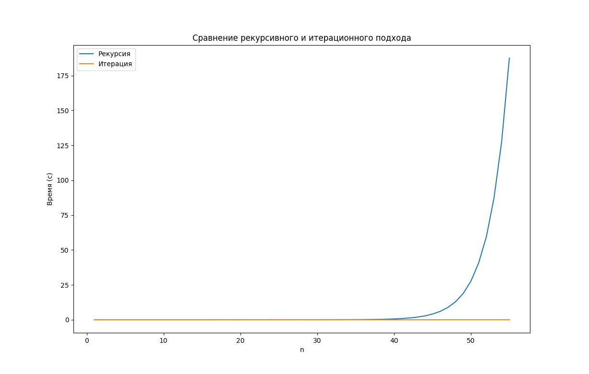

# Лабораторная работа 5

Задана рекуррентная функция. Область определения функции – натуральные числа. Написать программу сравнительного вычисления данной функции рекурсивно и итерационно. Определить границы применимости рекурсивного и итерационного подхода. Результаты сравнительного исследования времени вычисления представить в табличной и графической форме.

F(x<2) = 1; F(n) = 2F(n-1) + F(n-3)

# Результаты сравнения

### Графики
